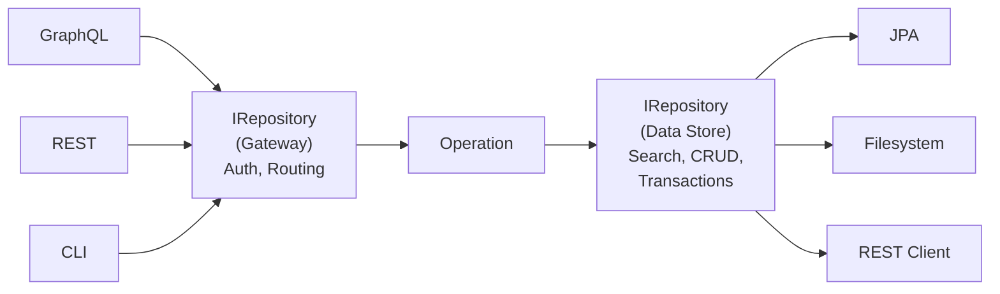
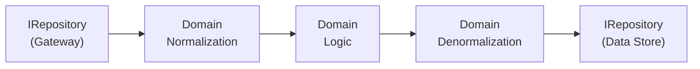
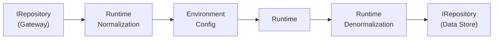
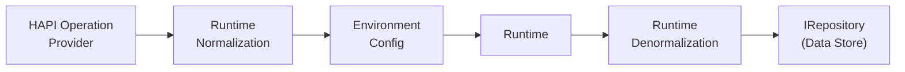

# Architecture

This document describes the high-level vision and architecture of CQF Clinical Reasoning on FHIR. It is intended to help developers and agents orient quickly.

The keywords "MUST", "MUST NOT", "REQUIRED", "SHALL", "SHALL NOT", "SHOULD", "SHOULD NOT", "RECOMMENDED", "MAY", and "OPTIONAL" in this project are to be interpreted as described in [RFC 2119](https://datatracker.ietf.org/doc/html/rfc2119).
However, for readability, these words do not appear in all uppercase letters in this document.

## Vision

Clinical knowledge, expressed as quality measures, care guidelines, decision support rules, and [related artifacts](https://hl7.org/fhir/uv/cpg/), is most valuable when it can be executed consistently wherever care happens.
This project provides the runtime engine for that execution.

We implement the evaluation and integration layer of the [clinical quality lifecycle](https://hl7.org/fhir/uv/cpg/#702-clinical-quality-lifecycle).
Given computable clinical logic authored in [FHIR](https://hl7.org/fhir/) and [CQL](https://cql.hl7.org/), this project enables any JVM-based system to evaluate that logic against patient data:
running [quality measures](https://www.hl7.org/fhir/us/cqfmeasures/), applying [care plans](https://hl7.org/fhir/uv/cpg/), generating case reports, and supporting prior authorization workflows.

Our scope boundary is deliberate. Upstream, we assume well-formed FHIR knowledge artifacts. Downstream, we produce computable results that other systems act upon.
This positions us as the portable clinical reasoning runtime that FHIR servers, mobile applications, analytics platforms, and IDE tooling can all share.

By making clinical logic portable and reusable across platforms, we help close the feedback loop of the learning health system:
evidence becomes computable guidelines, guidelines execute at the point of care, and the resulting data informs better evidence.

**Write clinical logic once, run it anywhere**. Every structural decision flows from that. Every requirement, architecture decision, and line of code must serve this vision.

**Fundamental principle: Vision > requirements > architecture > code.**

If the vision appears to be inconsistent, you must seek to clarify or align the vision before making architectural or code changes.
If requirements are misaligned with the vision, you must clarify the requirements to better align with the vision.
If the architecture is out of sync with the vision, you must refactor the architecture to better serve the vision.
If the requirements and architecture are incompatible, you must inform the user of alternatives to make them compatible and the tradeoffs that entails.
If the code is not well-aligned with the architecture, you must refactor the code to better fit the architectural design.

The vision and design goals of the project should guide architectural decisions, which in turn should guide code-level implementation.
Code is the lowest level of abstraction and should be organized to best serve the architecture and ultimately the vision of providing robust, FHIR-enabled clinical reasoning capabilities.

## Hexagonal Architecture

The project follows [Hexagonal Architecture](https://alistair.cockburn.us/hexagonal-architecture/) (Ports & Adapters). The central abstraction is `IRepository`, a Java projection of the FHIR REST API. It serves as the port on both the gateway (inbound) and data store (outbound) sides. An operation is a capsule of logic that sits between two repositories: it receives data through one and persists results through the other.

Operations exist at different levels of complexity. Each level builds on the previous:

**Generic operation.** Simple FHIR-to-FHIR logic. Repository in, operation, Repository out.



**Specialized domain.** When the operation needs version-agnostic domain types. FHIR resources are normalized to domain representations, domain logic executes, and results are denormalized back to FHIR.



CRMI operations (`$release`, `$package`, `$draft`, `$approve`) follow this pattern. They accept an `IRepository` as their data store, normalize FHIR resources to adapter representations via `IKnowledgeArtifactAdapter`, execute domain logic through the visitor pattern (`ReleaseVisitor`, `PackageVisitor`, etc.), and denormalize results back to FHIR transaction bundles. They do not require environment configuration or CQL evaluation. The `IRepository` they receive is used directly, not composed from endpoint parameters.

**Clinical reasoning runtime.** The pattern used by `$evaluate-measure`, `$apply`, and similar operations. Adds environment configuration (resolving `dataEndpoint`, `terminologyEndpoint` into a composed `ProxyRepository`) and treats the domain logic as a runtime for standards-based content (CQL, FHIR resources define the logic; Java provides the execution environment).



**HAPI integration.** HAPI's `@Operation` annotation-driven routing replaces the inbound `IRepository` with a HAPI Operation Provider. This is a degraded form of the canonical architecture: HAPI handles REST parsing and routing, so the gateway is no longer a clean `IRepository` boundary.



The first three levels represent the canonical architecture. The HAPI integration is the most common deployment but not the architectural ideal. Code should be structured for the canonical case; the HAPI adapter wraps it.

Processor classes like `R4MeasureProcessor` and CRMI services like `R4ReleaseService` accept an `IRepository`, but this is the **data store** port. Gateway logic (request parsing, routing, auth) has already happened by the time they are invoked. The canonical gateway `IRepository` shown in the Generic operation diagram represents an architectural goal: a uniform inbound port that any transport (REST, CLI, GraphQL) can implement. Today, the CLI module comes closest to this ideal. In the HAPI deployment, the HAPI Operation Provider serves as the gateway and constructs the processor with a data store `IRepository`.

## Code Map

```
cqf-fhir-bom/          Bill of Materials for downstream dependency management
cqf-fhir-utility/      FHIR utilities, IRepository API, repository implementations
cqf-fhir-cql/          FHIR ↔ CQL interop (library resolution, CQL evaluation via Repository)
cqf-fhir-cr/           Operation implementations ($evaluate-measure, $apply, etc.)
cqf-fhir-cr-spring/    Base Spring configuration for clinical reasoning (not HAPI-specific)
cqf-fhir-cr-hapi/      HAPI FHIR integration: provider registration, Spring configs, JPA wiring
cqf-fhir-cr-cli/       CLI transport adapter (Spring Boot fat JAR)
cqf-fhir-test/         Test utilities and fixtures for clinical reasoning operations
```

**Domain core** refers to version-agnostic logic and types that have no dependency on a specific FHIR version or transport mechanism. The boundary is architectural, not organizational: if code imports version-specific FHIR types or transport types, it is outside the domain core. Today this logic lives in `common` packages within `cqf-fhir-cr` and in shared abstractions in `cqf-fhir-utility` and `cqf-fhir-cql`. A cleaner separation, e.g. extracting `measure` and `plandefinition` common code into dedicated packages, is a standing goal. When evaluating whether code belongs in the domain core, apply the key invariants below.

## Operation Pipeline

Every FHIR operation follows the same pipeline through the layers:

1. **Transport** parses platform-specific input into typed request objects.
2. **Environment Resolution** separates endpoint config from operation params, composes an `IRepository`.
3. **Normalization** reads the target FHIR resource via Repository, converts to domain representation (if needed).
4. **Domain Evaluation** (optional) runs version-agnostic logic over domain types, data access via configured `IRepository`. Operations like `$evaluate-measure` and `$apply` use this layer; simpler FHIR-to-FHIR operations skip it.
5. **Denormalization** converts domain results (or FHIR resources directly) back to version-specific FHIR output.
6. **Transport** translates domain exceptions to platform-appropriate errors, returns response.

When an operation skips domain evaluation (e.g. a simple FHIR-to-FHIR transformation), the normalization and denormalization steps handle input/output mapping directly. CRMI operations like `$draft` illustrate a lightweight version of this: the visitor performs both domain logic and result construction, but the logic is simple enough that no separate domain evaluation layer is needed. The operation's logic lives in a dedicated processor or visitor class, not in the normalizer. Invariant 5 still holds.

## Key Invariants

These rules must hold. If they break, the architecture is degrading.

1. **Domain core never imports version-specific FHIR types** (`org.hl7.fhir.r4.model.*`, `org.hl7.fhir.dstu3.model.*`).
2. **Domain core never imports transport types** (`ca.uhn.fhir.rest.server.exceptions.*`).
3. **Domain core assumes a configured environment.** It receives a composed `IRepository` and domain parameters, never raw endpoint URLs.
4. **All data access goes through `IRepository`.** No direct JPA, HTTP, or filesystem calls from domain, normalization, or denormalization code.
5. **Each layer has one job.** If a class spans layers, split it.

## The Repository API

`IRepository` is a Java projection of the FHIR REST API and the single driven-side port for all data access. It is what makes portability possible: the same domain logic runs against JPA, REST, SQLite, filesystem, or in-memory backends by swapping the repository implementation.

Repositories compose: `ProxyRepository` routes data/terminology/content to different backends; `FederatedRepository` overlays additional data on a base. This composition happens during environment resolution, never in domain code.

## HAPI FHIR Integration

The primary deployment target is a HAPI FHIR server. The `cqf-fhir-cr-hapi` module is the transport adapter that wires clinical reasoning operations into HAPI's `RestfulServer` via Spring. HAPI's `@Operation` annotations are accepted in the transport adapter as a deployment necessity. The coding value "no annotations-as-logic" applies to domain and normalization code. Annotations must not drive clinical logic or data transformation behavior.

## Cross-Cutting Concerns

**Error handling.** Domain core throws domain exceptions (`MeasureValidationException`, `EvaluationException`).
Normalization and denormalization layers may throw resolution exceptions (e.g. when a required resource cannot be resolved from the repository). Only the transport adapter translates these to HTTP status codes or CLI exit codes.
Domain, normalization, and denormalization code must never throw transport exceptions.

**FHIR version support.** DSTU3 and R4 have full symmetric support: each has its own normalizer/denormalizer pair while sharing the domain core. R5 has partial support (adapters, visitors, repository composition) but does not yet have full operation-level normalization/denormalization.

**Testing.** `cqf-fhir-test` provides utilities and fixtures.
Domain logic is testable with in-memory or filesystem repositories, no server required.

## Design Decisions

**Why hexagonal?** The vision requires the same logic to run on FHIR servers, Android, Spark, VS Code, and CLI.
Hexagonal architecture isolates the domain from any specific host, making this possible without forking.

**Why version-agnostic domain types?** FHIR has multiple versions (DSTU3, R4, R5) with structural differences.
Domain types like `MeasureDef` normalize these differences so evaluation logic is written once.

**Why `IRepository` mirrors FHIR REST?** FHIR REST is the lingua franca of clinical data systems.
By projecting the same interface into Java, any FHIR-capable system can serve as a data backend with minimal adapter code.

**Why separate environment resolution?** Parameters like `dataEndpoint` and `terminologyEndpoint` configure how data is accessed, not what the operation does.
Separating them keeps the domain core focused on clinical logic and makes it testable with simple in-memory repositories.

## Coding Values

When making design trade-offs, prefer:

- **First principles over pragmatism.** Understand why a pattern exists before applying it. Don't copy existing code that may have drifted from the intended architecture.
- **Explicit over implicit.** No magic, no annotations-as-logic. Declare and enforce invariants. If behavior isn't obvious from reading the code, make it obvious.
- **Data transformation over stateful logic.** Model operations as pipelines that transform data in, results out. Avoid mutable state in services and utilities.
- **Locality over distribution.** Keep related code together. Avoid the need to jump between packages or modules to understand a feature.
- **Fail loudly over silent errors.** Throw domain exceptions with structured information. Never swallow errors or return nulls to signal failure.
- **Easier to delete over easier to extend.** When uncertain, choose the approach that's simpler to remove later. Build it yourself rather than add a dependency.
- **Tests as documentation.** Tests should clearly demonstrate how the code is intended to be used and what the expected behavior is. They are a critical part of the codebase, not an afterthought.

Utility classes should be stateless (`static` methods, no mutable fields). Class-specific utilities use the pluralized name of the class they serve (e.g., `Clients` for `Client`). Behavior shared across classes should be modeled as interfaces with `default` methods, not utility superclasses.

