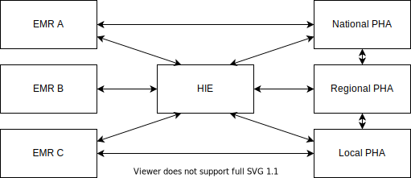
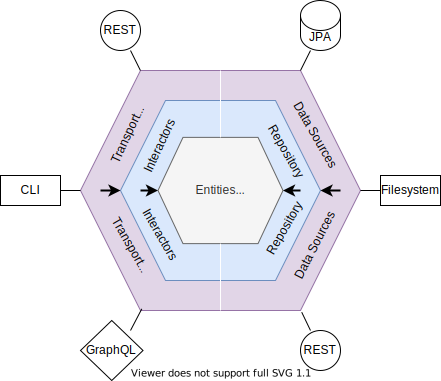

# Developer Guide

## Repository Structure

This is a table of current artifacts in this project, and short description of what each artifact contains. See the [Architecture](#architecture) section for more detailed information on why this project is structured this way.

| Artifact | Description |
|-------|------|
|`cqf-fhir-api` | FHIR platform services, FHIR repository APIs. The set of interfaces a platform needs to implement to use this project are contained here. |
| `cqf-fhir-bom` | Maven "Bill of Materials" for this repository, simplifying dependency management in downstream projects. |
| `cqf-fhir-utility` | Utilities to assist in the creation of FHIR clinical reasoning operations. Implementations of the above APIs for REST and in-memory use cases also live here, and act as a reference for how to implement the above APIs. |
| `cqf-fhir-test`| Utilities to assist writing unit tests for clinical reasoning operations. |
| `cqf-fhir-cql` | Core project for FHIR / CQL interop |
| `cqf-fhir-cr` | FHIR clinical reasoning operation implementations, such as `Measure/$evaluate-measure` and `PlanDefinition/$apply` |
| `cqf-fhir-cr-cli` | CLI tool for running FHIR clinical reasoning operations |
| `cqf-fhir-jaxb` | Aggregator project for JAXB dependencies |
| `cqf-fhir-jackson` | Aggregator project for Jackson dependencies |

## Contributing

See the [Java Guidance](#java-guidance) section for more detailed information.

### Getting Started

Java 11+ is required to build and run this project. You can build the project with `mvn package`.

### Licensing

All contributions to this project will be licensed under Apache 2.0

### Extensions

If you're using VS Code, the `clinical-reasoning` repo suggests a list of Java extensions for static and style analysis. Please enable these recommended extensions, as they help detect issues with contributions prior to committing them or opening a PR.

### Style Guide

This project uses the [Google Java Style](https://google.github.io/styleguide/javaguide.html). Default formatter settings are already configured for VS Code. If you use another editor, please set it up accordingly.

### Branch Policy

All new development takes place on `<feature>` branches off `master`. Once feature development on the branch is complete, the feature branch is submitted to `master` as a PR. The PR is reviewed by maintainers and regression testing by the CI build occurs.

Changes to the `master` branch must be done through an approved PR. Delete branches after merging to keep the repository clean.

See [Release Process](TODO) for related information.

## Usage

In general, the clinical reasoning modules contained on this project can be enabled on a given platform by implementing the [FHIR Repository API](TODO). There are examples for that:

* In HAPI, connecting to a JPA layer
* On Android, connecting to SQLite
* In the test utilities, using a filesystem
* In the client utilities, connecting to a remote FHIR server
* In the standalone examples, using an in-memory data structure

The specific usage of each module is documented in the module-specific section of the documentation. The [Architecture](#architecture) gives an overview of why the FHIR Repository API was chosen and its design goals.

## Architecture

### Background

"Clinical Reasoning" is the application business logic in clinical settings. For example, given a certain diagnosis a clinician may prescribe a certain medication, or given a positive lab result for a contagious disease laws may require reporting of that result to a Public Health Authority (PHA). The primary concern of this repository is developing Clinical Reasoning capabilities for FHIR applications.

[FHIR](https://hl7.org/fhir/) is an platform is building interoperable clinical systems of systems (SoS). Use cases include:

* Storing electronic clinical data (EMRs)
* Data exchange across payers, public health authorities, heath information exchanges, and between independent EMRs
* Reporting clinical quality metrics or disease surveillance
* Research and analytics on patient data
* Creation and distribution of standardized clinical logic that can be run anywhere FHIR is supported

FHIR defines a dedicated [Clinical Reasoning module](https://build.fhir.org/clinicalreasoning-module.html) and that are numerous derivative "Implementation Guides" (IGs) that specify new uses based upon the core module, such as the [CQF Measures IG](https://build.fhir.org/ig/HL7/cqf-measures/) that describes how to use Quality Measures within the FHIR ecosystem.

#### Systems of Systems

Systems of Systems are collaborating systems that exhibit operational and managerial independence.

* Operational independence - each constituent system is operated to achieve a useful purpose independently
* Managerial independence - each constituent system evolves to achieve its own ends independently

Within the healthcare space an example are the various Electronic Medical Record (EMR) systems, Healthcare Information Exchanges (HIE), and Public Health Authorities (PHA) that interoperate for various purposes such as public health reporting, exchanging patient data, and so on.



A common approach to scaling an SoS is to build a "platform". An SoS platform:

* Promotes interoperability through
    * Common communication mechanisms
    * Common information models (semantics)
    * Patterns or sequences of interaction
* Provides services and functions to all constituent systems
* Reduces time and effort to develop or modify systems by
    * Providing reference or concrete implementations of services
    * Replacing point-to-point integration with system-to-platform integration
    * Reducing barrier to entry for new systems to join SoS
* Enables modular substitution systems in the SoS
    * Which supports an “ecosystem”

The Internet is an example of an SoS platform:

* Common communication mechanisms
    * TCP/HTTP
* System-to-platform integration
    * DNS servers allow you to access anything, anywhere
* Well-established patterns and sequences of interactions
    * REST
* Connecting to one server looks like connecting to any other
    * Allows (nearly) transparent middleware
        * Routers, proxies, caching, authentication
    * Allows arbitrarily deep/complex networks

An SoS Platform is frequently described as a set of standards. For example, all the RFCs that are published by the IETF for the Internet that describe things like REST. These standards function as a formal description of a set of functionality within the overall platform. SDKs for developing Internet applications exist in almost every programming language, such as HTTP client libraries.

#### FHIR Platform

FHIR is an SoS Platform built on top of web standards and focused on clinical concepts. [Health Level Seven International](https://www.hl7.org/) (HL7) manages the development of FHIR. FHIR provides (among other things):

* A Common data (meta)model and semantics
    * FHIR "Resources" representing clinical concepts such as Patient, Encounter, Medication, etc.
* Common patterns for interaction
    * FHIR REST API
    * SMART-on-FHIR
    * Bulk Data
* Extensibility and discovery mechanisms for adding new functionality to a systems

Additionally, HL7 funds the development of reference implementations and provides some platform services, such as a common package registry for FHIR publications.

### HAPI FHIR

[HAPI FHIR](https://hapifhir.io/hapi-fhir) is an open-source Java SDK for building FHIR applications. It defines a set of object models, a persistence layer, an implementation of the FHIR REST API, and forms the basis of this project. In turn, some of the operations defined here are used to provide Clinical Reasoning functionality on the HAPI FHIR Server.

[Smile Digital Health](https://www.smilecdr.com/) is the maintainer and publisher of that HAPI FHIR project. The publisher of this project, [Alphora](https://www.alphora.com/), is a subsidiary of Smile Digital Health.

### Design Goals

This project is designed to provide reusable Clinical Reasoning modules for any Java and HAPI based application. This includes:

* Android, as part of the [Google FHIR SDK](TODO)
* [eCR Now](TODO), the CDC's reference implementation for contagious disease surveillance
* Spark, for analytics use cases
    * [Alphora](https://www.alphora.com/) provides a commercial solution
* VS Code, through the [LSP](https://github.com/cqframework/vscode-cql)
    * Provides an IDE for authoring clinical logic in terms of FHIR/CQL
* [HAPI FHIR Server](https://github.com/hapifhir/hapi-fhir), an open-source Clinical Data Repository (CDR)
* [Smile CDR](https://www.smilecdr.com/smilecdr), a commercial CDR
* Various other open-source and commercial implementations

### Hexagonal Architecture

Hexagonal architecture is an approach that abstracts the repository layer so that logic modules can be reused. This is a form of IoC, flipping the top-down dependencies that are common in layered architecture.

* Dependencies point outside-in instead of top-down
* Common data model at the core (HAPI FHIR)
* Repository abstraction allows multiple backends
* Common in microservice architectures - Mini SoS!



The modules in this project can be used on any platform that is able to implement the FHIR Repository API.

### FHIR Repository

The FHIR Repository API is essentially a Java projection of the FHIR REST API. This allows the composition of FHIR services (and in particular clinical reasoning services) because each layer looks the same to both the layer above and the layer below, much like how the Internet is a set of inter-connected services, some of which provide routing, proxying, caching, etc. It also gives a relatively small API surface that needs to be implemented in order to support clinical reasoning on a given platform. The API is specified [here](TODO).

## Java Guidance

This section contains some high-level guidance on style, best-practices, conventions, etc. [Architecture](#architecture) is covered further below.

### Discovery and Maintainability

Following conventions such as those below make it easier for the next developer to find code that's already been implemented and  to understand and improve code that's already been written more easily.

### Best Practices

Code should generally follow Java best-practices as outlined in [Effective Java 3rd Edition](https://www.pearson.com/us/higher-education/program/Bloch-Effective-Java-3rd-Edition/PGM1763855.html).

If using VS Code, the Sonarlint plugin will be suggested to help detect issues early on.

### Javadoc

This project has strict checking for Javadoc enabled.  This will cause a build failure in the event of a Javadoc warning.  Visit <https://www.oracle.com/technical-resources/articles/java/javadoc-tool.html> for more info.

Results of Javadoc can be found in the output of the build.

### Testing

Most of the components and operations in this repository are built around an interface representing a conceptual FHIR API, the idea being that any given Java-based FHIR platform or toolkit can provide an implementation of this API to enabled the use of CQL or Clinical Reasoning on that platform. The `cqf-fhir-test` project provides a set of utilities (specifically an implementation of that API that can read test `resource` files) to facilitate easier unit testing. There are examples of tests using this utility [here](TODO)

### Naming Conventions

#### Package names

* Should be rooted with `org.opencds.cqf.fhir`
* For the sake of brevity, `clinicalreasoning` is abbreviated `cr` in package names
* Package names should reflect high-level areas of functionality:
    * `org.opencds.cqf.fhir.utility`
        * Non-FHIR version specific utilities
    * `org.opencds.cqf.fhir.cql`
        * Non-FHIR version specific CQL components
* If a FHIR version is specified, it should come after the high-level functionality described:
    * `org.opencds.cqf.fhir.cql.r5`
        * An example package name for CQL-related functionality tied to R5
* If a Resource name if specified, it should generally come after the FHIR version
    * `org.opencds.cqf.fhir.cr.dstu3.measure`
        * An example package name for Measure-related functionality tied to DSTU3
        * Exception: There may be a few cases where functionality for a Resource is not FHIR-version specific, in which case the FHIR version should be omitted
            * `org.opencds.cqf.fhir.cr.plandefinition`
* Generally, the package name prefix should one of:
    * `org.opencds.cqf.fhir.api`
    * `org.opencds.cqf.fhir.utility`
    * `org.opencds.cqf.fhir.cql`
    * `org.opencds.cqf.fhir.elm`
    * `org.opencds.cqf.fhir.cr`
    * `org.opencds.cqf.fhir.cdshooks`
    * If you find a use case that doesn't fall under one those prefixes, it may be out of scope for this repository.
* Java 9+ modules require that each artifact have only one root package name that's exported. If you find the need for multiple root namespaces, consider that you may need to create a new artifact.

#### Artifact names

* Should start with `cqf-fhir`
* Should reflect the root package name for the artifact
    * `org.opencds.cqf.fhir.cql` -> `cqf-fhir-cql`
    * `org.opencds.cqf.fhir.utility` -> `cqf-fhir-utility`
* Exception: If there is a FHIR-version in the package name, it should come _last_ in the artifact name. This is to match the conventions already established by the FHIR core and HAPI FHIR projects
    * `org.opencds.cqf.fhir.cr.r5.measure` -> `cqf-fhir-cr-measure-r5`

#### Class names

* Should follow the conventions established by [Effective Java](#best-practices).
* Utility classes should follow the conventions established in the [Utilities](#utilities) section.
* There are several cases where this project implements a "runtime" for standards-based content. In other words, the clinical logic isn't implemented by java, but rather by some FHIR Resource or CQL, and the Java provides an execution environment for that logic:
    * `Measure` evaluation
    * `PlanDefinition` application
    * `ActivityDefinition` application
  These cases require special approaches to design an extensible and debuggable runtime, discussed further in the [Architecture](#architecture) section, and the class names should follow conventions for naming runtimes:
        * `CqlEngine`
        * `FhirPathEngine`
        * `MeasureEvaluationRuntime`
        * `ActivityDefinitionEngine`

### Design Conventions

### Utilities

#### Types of Utilities

In general, reusable utilities are separated along two different dimensions, Classes and Behaviors.

Class specific utilities are functions that are associated with specific class or interface, and add functionality to that class.

Behavior specific utilities allow the reuse of behavior across many different classes.

##### Class Specific Utilities

Utility or Helper methods that are associated with a single class should go into a class that has the pluralized name of the associated class. For example, utilities for `Client` should go into the `Clients` class. This ensures that the utility class is focused on one class and allows for more readable code:

`Clients.forUrl("test.com")`

as opposed to:

`ClientUtilities.createClient("test.com")`

or, if you put unrelated code into the class, you might end up with something like:

`Clients.parseRegex()`

If the code doesn't read clearly after you've added an utility, consider that it may not be in the right place.

In general, all the functions for this type of utility should be `static`. No internal state should be maintained (`static final`, or immutable, state is ok). If you final that your utility class contains mutable state, consider an alternate design.

Examples

* Factory functions
* Adding behavior to a class you can't extend

##### Behavior Specific Utilities

If there is behavior you'd like to share across many classes, model that as an interface and use a name that follows the pattern `"ThingDoer"`. For example, all the classes that access a database might be `DatabaseReader`. Use `default` interface implementations to write logic that can be shared many places. The interfaces themselves shouldn't have mutable state (again `static final` is ok). If it's necessary for the for shared logic to have access to state, model that as an method without a default implementation. For example:

```java
interface DatabaseReader {
   Database getDb();
   default Entity read(Id id) {
      return getDb().connect().find(id);
   }
}
```

In the above example any class that has access to a `Database` can inherit the `read` behavior.

Examples

* Cross-cutting concerns
    * Data Access
    * Logging
    * Parameter Validation

Functions associated with only one operation or a small set of related classes should not be modeled as a "Behavior". Default interfaces can be easily abused in this way. Ask yourself "would I use this in an operation for a totally unrelated FHIR Resource?". If not, it's not a cross-cutting behavior.
