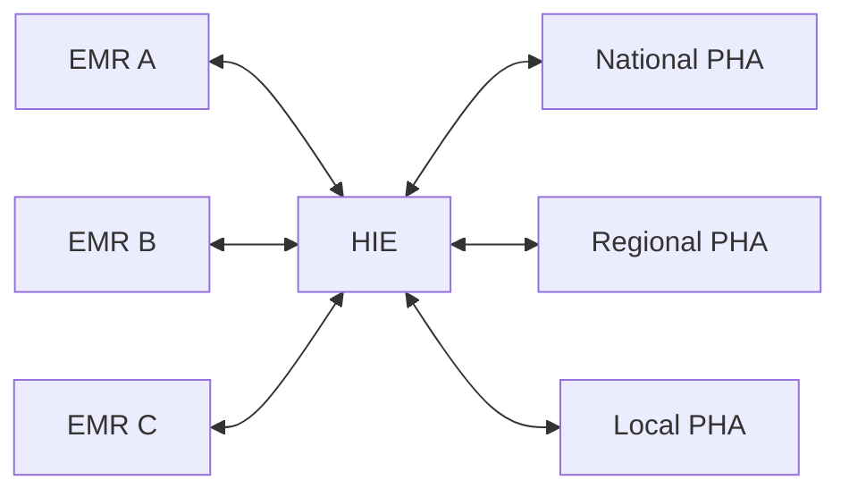
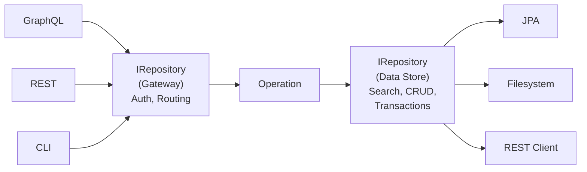
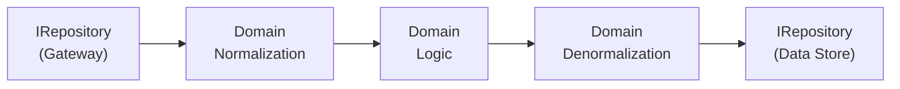
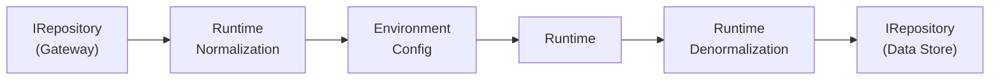
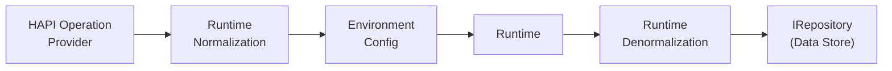
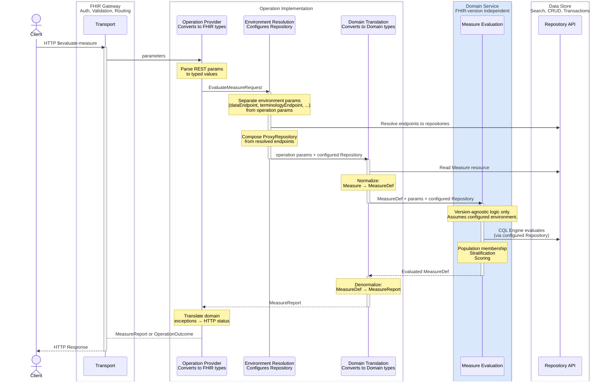

# Developer Guide

## Repository Structure

This is a table of current artifacts in this project, and short description of what each artifact contains. See the [Architecture](#architecture) section for more detailed information on why this project is structured this way.

| Artifact | Description |
|-------|------|
| `cqf-fhir-bom` | Maven "Bill of Materials" for this repository, simplifying dependency management in downstream projects. |
| `cqf-fhir-utility` | Utilities to assist in the creation of FHIR clinical reasoning operations. Implementations of the above APIs for REST and in-memory use cases also live here, and act as a reference for how to implement the above APIs. |
| `cqf-fhir-test`| Utilities to assist writing unit tests for clinical reasoning operations. |
| `cqf-fhir-cql` | Core project for FHIR / CQL interop |
| `cqf-fhir-cr` | FHIR clinical reasoning operation implementations, such as `Measure/$evaluate-measure` and `PlanDefinition/$apply` |
| `cqf-fhir-cr-hapi` | HAPI FHIR server integration. Transport adapter that connects clinical reasoning operations to HAPI's `@Operation` annotation-driven routing. |
| `cqf-fhir-cr-spring` | Spring auto-configuration for wiring clinical reasoning components into Spring-based applications. |
| `cqf-fhir-cr-cli` | CLI tool for running FHIR clinical reasoning operations |
| `cqf-fhir-benchmark` | JMH performance benchmarks for clinical reasoning operations. Not published to Maven Central. |

## Contributing

See the [Java Guidance](#java-guidance) section for more detailed information.

### Getting Started

Java 17+ is required to build and run this project. You can build the project with `./gradlew build`.

### Licensing

All contributions to this project will be licensed under Apache 2.0

### Extensions

If you're using VS Code, the `clinical-reasoning` repo suggests a list of Java extensions for static and style analysis. Please enable these recommended extensions, as they help detect issues with contributions prior to committing them or opening a PR.

### Style Guide

This project uses [Palantir Java Format](https://github.com/palantir/palantir-java-format), applied automatically via [Spotless](https://github.com/diffplug/spotless). Run `./gradlew spotlessApply` to format code, or `./gradlew spotlessCheck` to verify formatting. Default formatter settings are already configured for VS Code. If you use another editor, please set it up accordingly.

### Branch Policy

All new development takes place on `<feature>` branches off `master`. Once feature development on the branch is complete, the feature branch is submitted to `master` as a PR. The PR is reviewed by maintainers and regression testing by the CI build occurs.

Changes to the `master` branch must be done through an approved PR. Delete branches after merging to keep the repository clean.

See Release Process for related information.

## Usage

In general, the clinical reasoning modules contained on this project can be enabled on a given platform by implementing the [FHIR Repository API](#fhir-repository). There are examples for that:

* In HAPI, connecting to a JPA layer
* On Android, connecting to SQLite
* In the test utilities, using a filesystem
* In the client utilities, connecting to a remote FHIR server
* In the standalone examples, using an in-memory data structure

The specific usage of each module is documented in the module-specific section of the documentation. The [Architecture](#architecture) gives an overview of why the FHIR Repository API was chosen and its design goals.

## Architecture

### Background

"Clinical Reasoning" is the application business logic in clinical settings. For example, given a certain diagnosis a clinician may prescribe a certain medication, or given a positive lab result for a contagious disease laws may require reporting of that result to a Public Health Authority (PHA). The primary concern of this repository is developing Clinical Reasoning capabilities for FHIR applications.

[FHIR](https://hl7.org/fhir/) is a platform for building interoperable clinical systems of systems (SoS). Use cases include:

* Storing electronic clinical data (EMRs)
* Data exchange across payers, public health authorities, heath information exchanges, and between independent EMRs
* Reporting clinical quality metrics or disease surveillance
* Research and analytics on patient data
* Creation and distribution of standardized clinical logic that can be run anywhere FHIR is supported

FHIR defines a dedicated [Clinical Reasoning module](https://build.fhir.org/clinicalreasoning-module.html) and there are numerous derivative "Implementation Guides" (IGs) that specify new uses based upon the core module, such as the [CQF Measures IG](https://build.fhir.org/ig/HL7/cqf-measures/) that describes how to use Quality Measures within the FHIR ecosystem.


#### Systems of Systems

Systems of Systems are collaborating systems that exhibit operational and managerial independence.

* Operational independence - each constituent system is operated to achieve a useful purpose independently
* Managerial independence - each constituent system evolves to achieve its own ends independently

Within the healthcare space an example are the various Electronic Medical Record (EMR) systems, Healthcare Information Exchanges (HIE), and Public Health Authorities (PHA) that interoperate for various purposes such as public health reporting, exchanging patient data, and so on.


```mermaid
flowchart LR
    A["EMR A"]
    B["EMR B"]
    C["EMR C"]
    A <--> HIE["HIE"]
    B <--> HIE
    C <--> HIE
    HIE <--> N["National PHA"]
    HIE <--> R["Regional PHA"]
    HIE <--> L["Local PHA"]
```

A common approach to scaling an SoS is to build a "platform". An SoS platform:

* Promotes interoperability through
    * Common communication mechanisms
    * Common information models (semantics)
    * Patterns or sequences of interaction
* Provides services and functions to all constituent systems
* Reduces time and effort to develop or modify systems by
    * Providing reference or concrete implementations of services
    * Replacing point-to-point integration with system-to-platform integration
    * Reducing barrier to entry for new systems to join SoS
* Enables modular substitution systems in the SoS
    * Which supports an “ecosystem”

The Internet is an example of an SoS platform:

* Common communication mechanisms
    * TCP/HTTP
* System-to-platform integration
    * DNS servers allow you to access anything, anywhere
* Well-established patterns and sequences of interactions
    * REST
* Connecting to one server looks like connecting to any other
    * Allows (nearly) transparent middleware
        * Routers, proxies, caching, authentication
    * Allows arbitrarily deep/complex networks

An SoS Platform is frequently described as a set of standards. For example, all the RFCs that are published by the IETF for the Internet that describe things like REST. These standards function as a formal description of a set of functionality within the overall platform. SDKs for developing Internet applications exist in almost every programming language, such as HTTP client libraries.

#### FHIR Platform

FHIR is an SoS Platform built on top of web standards and focused on clinical concepts. [Health Level Seven International](https://www.hl7.org/) (HL7) manages the development of FHIR. FHIR provides (among other things):

* A Common data (meta)model and semantics
    * FHIR "Resources" representing clinical concepts such as Patient, Encounter, Medication, etc.
* Common patterns for interaction
    * FHIR REST API
    * SMART-on-FHIR
    * Bulk Data
* Extensibility and discovery mechanisms for adding new functionality to a systems

Additionally, HL7 funds the development of reference implementations and provides some platform services, such as a common package registry for FHIR publications.

### HAPI FHIR

[HAPI FHIR](https://hapifhir.io/hapi-fhir) is an open-source Java SDK for building FHIR applications. It defines a set of object models, a persistence layer, an implementation of the FHIR REST API, and forms the basis of this project. In turn, some of the operations defined here are used to provide Clinical Reasoning functionality on the HAPI FHIR Server.

[Smile Digital Health](https://www.smilecdr.com/) is the maintainer and publisher of that HAPI FHIR project. The publisher of this project, [Alphora](https://www.alphora.com/), is a subsidiary of Smile Digital Health.

### Design Goals

This project is designed to provide reusable Clinical Reasoning modules for any Java and HAPI based application. This includes:

* Android, as part of the [Android FHIR SDK](https://github.com/google/android-fhir)
* [eCR Now](https://github.com/CDCgov/eCR-FHIR-app-HCS), the CDC's reference implementation for contagious disease surveillance
* Spark, for analytics use cases
    * [Alphora](https://www.alphora.com/) provides a commercial solution
* VS Code, through the [LSP](https://github.com/cqframework/vscode-cql)
    * Provides an IDE for authoring clinical logic in terms of FHIR/CQL
* [HAPI FHIR Server](https://github.com/hapifhir/hapi-fhir), an open-source Clinical Data Repository (CDR)
* [Smile CDR](https://www.smilecdr.com/smilecdr), a commercial CDR
* Various other open-source and commercial implementations

### Hexagonal Architecture

This project follows [Hexagonal Architecture](https://alistair.cockburn.us/hexagonal-architecture/) (also called Ports & Adapters). The central abstraction is `IRepository`, a Java projection of the FHIR REST API. It serves as the port on both the gateway (inbound) and data store (outbound) sides. An operation is a capsule of logic that sits between two repositories: it receives data through one and persists results through the other.

Operations exist at different levels of complexity. Each level builds on the previous:

**Generic operation.** Simple FHIR-to-FHIR logic. Repository in, operation, Repository out.


```mermaid
graph LR
    GRAPHQL["GraphQL"] --> R1
    REST["REST"] --> R1
    CLI["CLI"] --> R1
    R1["IRepository<br/>(Gateway)<br/>Auth, Routing"] --> Op["Operation"] --> R2["IRepository<br/>(Data Store)<br/>Search, CRUD,<br/>Transactions"]
    R2 --> JPA["JPA"]
    R2 --> FS["Filesystem"]
    R2 --> RC["REST Client"]
```

**Specialized domain.** When the operation needs version-agnostic domain types. FHIR resources are normalized to domain representations, domain logic executes, and results are denormalized back to FHIR.


```mermaid
graph LR
    R1["IRepository<br/>(Gateway)"] --> Norm["Domain<br/>Normalization"] --> DL["Domain<br/>Logic"] --> Denorm["Domain<br/>Denormalization"] --> R2["IRepository<br/>(Data Store)"]
```

CRMI operations (`$release`, `$package`, `$draft`, `$approve`) follow this pattern. They accept an `IRepository` as their data store, normalize FHIR resources to adapter representations via `IKnowledgeArtifactAdapter`, execute domain logic through the visitor pattern (`ReleaseVisitor`, `PackageVisitor`, etc.), and denormalize results back to FHIR transaction bundles. They do not require environment configuration or CQL evaluation. The `IRepository` they receive is used directly, not composed from endpoint parameters.

**Clinical reasoning runtime.** The pattern used by `$evaluate-measure`, `$apply`, and similar operations. Adds environment configuration (resolving `dataEndpoint`, `terminologyEndpoint` into a composed `ProxyRepository`) and treats the domain logic as a runtime for standards-based content (CQL, FHIR resources define the logic; Java provides the execution environment).


```mermaid
graph LR
    R1["IRepository<br/>(Gateway)"] --> RN["Runtime<br/>Normalization"] --> Env["Environment<br/>Config"] --> RT["Runtime"] --> RD["Runtime<br/>Denormalization"] --> R2["IRepository<br/>(Data Store)"]
```

**HAPI integration.** HAPI's `@Operation` annotation-driven routing replaces the inbound `IRepository` with a HAPI Operation Provider. This is a degraded form of the canonical architecture: HAPI handles REST parsing and routing, so the gateway is no longer a clean `IRepository` boundary. HAPI's `@Operation` annotations are accepted in the transport adapter as a deployment necessity. The coding value "no annotations-as-logic" applies to domain and normalization code. Annotations must not drive clinical logic or data transformation behavior.


```mermaid
graph LR
    HAPI["HAPI Operation<br/>Provider"] --> RN["Runtime<br/>Normalization"] --> Env["Environment<br/>Config"] --> RT["Runtime"] --> RD["Runtime<br/>Denormalization"] --> R2["IRepository<br/>(Data Store)"]
```

The first three levels represent the canonical architecture. The HAPI integration is the most common deployment but not the architectural ideal. Code should be structured for the canonical case; the HAPI adapter wraps it.

Processor classes like `R4MeasureProcessor` and CRMI services like `R4ReleaseService` accept an `IRepository`, but this is the **data store** port. Gateway logic (request parsing, routing, auth) has already happened by the time they are invoked. The canonical gateway `IRepository` shown in the Generic operation diagram represents an architectural goal: a uniform inbound port that any transport (REST, CLI, GraphQL) can implement. Today, the CLI module comes closest to this ideal. In the HAPI deployment, the HAPI Operation Provider serves as the gateway and constructs the processor with a data store `IRepository`.

Notice how the structure of the architecture mirrors the structure of the systems of systems that FHIR is designed to support. The transport layer corresponds to the various platforms and interfaces that interact with the system. The domain core corresponds to the business logic that operates on clinical concepts. The repository API abstracts away the data sources, which could be any of the constituent systems in an SoS.

This design allows the clinical reasoning logic to be reusable across different platforms and data sources, as long as they can implement the Repository API. It's also an example of recursive architecture, where the same principles of modularity and separation of concerns apply at different levels of the system. This allows developers and agents to reuse the same mental model and design patterns at multiple levels in the system. 

### FHIR Repository

The FHIR Repository API (`IRepository`) is a Java projection of the FHIR REST API. It is the always-present driven adapter for all data access in this project. Every operation implementation accesses clinical data, terminology, and content exclusively through this interface.

This design allows clinical reasoning operations to run on any platform that implements `IRepository`:

- **HAPI JPA**: Connecting to a database via the HAPI persistence layer
- **Android**: Connecting to SQLite via the Google FHIR SDK
- **REST client**: Connecting to a remote FHIR server
- **Filesystem**: Reading FHIR resources from test fixtures or bundles
- **In-memory**: Using bundled data for standalone evaluation

Because `IRepository` mirrors the FHIR REST API, repositories compose naturally. A `ProxyRepository` routes content, terminology, and data requests to different backing repositories. A `FederatedRepository` overlays additional data on top of a base repository. This composition happens during environment resolution, not in the domain core.

### FHIR Operation Implementation Layers

When implementing a FHIR operation (e.g., `$evaluate-measure`, `$apply`), the code follows a consistent pipeline through the hexagonal layers. Each operation implementation is an isolated **capsule** of business logic that accepts FHIR at the top, operates on domain representations internally, and produces FHIR at the bottom. This self-contained unit can slot into (or between) any FHIR server. The Repository API provides FHIR translation on the data-access side.


```mermaid
sequenceDiagram
    actor Client
    box FHIR Gateway<br/>Auth, Validation, Routing
    participant Transport
    end
    box Operation Implementation
    participant OpProvider as Operation Provider<br/>Converts to FHIR types
    participant EnvConfig as Environment Resolution<br/>Configures Repository
    participant FHIR as Domain Translation<br/>Converts to Domain types
    end
    box rgb(218,232,252) Domain Service<br/>FHIR-version independent
    participant Domain as Measure Evaluation
    end
    box Data Store<br/>Search, CRUD, Transactions
    participant Repo as Repository API
    end

    Client->>Transport: HTTP $evaluate-measure
    activate Transport
    Transport->>OpProvider: parameters
    Note over OpProvider: Parse REST params<br/>to typed values

    OpProvider->>EnvConfig: EvaluateMeasureRequest
    activate EnvConfig
    Note over EnvConfig: Separate environment params<br/>(dataEndpoint, terminologyEndpoint, ...)<br/>from operation params
    EnvConfig->>Repo: Resolve endpoints to repositories
    Note over EnvConfig: Compose ProxyRepository<br/>from resolved endpoints
    EnvConfig->>FHIR: operation params + configured Repository
    deactivate EnvConfig

    activate FHIR
    FHIR->>Repo: Read Measure resource
    Note over FHIR: Normalize:<br/>Measure → MeasureDef
    FHIR->>Domain: MeasureDef + params + configured Repository
    deactivate FHIR

    activate Domain
    Note over Domain: Version-agnostic logic only.<br/>Assumes configured environment.
    Domain->>Repo: CQL Engine evaluates<br/>(via configured Repository)
    Note over Domain: Population membership<br/>Stratification<br/>Scoring
    Domain-->>FHIR: Evaluated MeasureDef
    deactivate Domain

    activate FHIR
    Note over FHIR: Denormalize:<br/>MeasureDef → MeasureReport
    FHIR-->>OpProvider: MeasureReport
    deactivate FHIR

    Note over OpProvider: Translate domain<br/>exceptions → HTTP status
    OpProvider-->Transport: MeasureReport or OperationOutcome
    Transport-->>Client: HTTP Response
    deactivate Transport
```

Note the recursive nature of the architecture in the above sequence diagram.

The transport layer accepts FHIR, normalizes it to domain types, and then the domain logic operates on those types. When the domain logic needs to access data, it goes through the Repository API, which provides FHIR-native data access. The results are then denormalized back to FHIR and returned to the client.

This pattern applies to all operations implemented in this project, providing a consistent structure for development and maintenance.
In the cases where a domain specific representation is not needed, the operation simply operates on FHIR resources.

#### Layer Responsibilities

Each layer has one job at one level of abstraction. If you need "and" to describe a layer's responsibility, it should be two layers.

**1. Transport Adapter** (`cqf-fhir-cr-hapi` or `cqf-fhir-cr-cli`)

- Accepts platform-specific input (HTTP `@OperationParam`, CLI arguments)
- Converts to typed domain request objects
- Delegates to the FHIR translation / operation facade
- Translates domain exceptions to platform-appropriate responses (HTTP status codes, CLI exit codes)
- This is the **only** layer that imports `ca.uhn.fhir.rest.server.exceptions.*`

**2. Environment Resolution**

- Separates environment configuration parameters (`dataEndpoint`, `terminologyEndpoint`, `contentEndpoint`, etc.) from operation parameters
- Resolves endpoint parameters into concrete Repository instances
- Composes a single `ProxyRepository` (via `Repositories.proxy()`) that routes data, terminology, and content requests to the appropriate backing repositories
- The domain core receives a fully configured Repository and never sees raw endpoint configuration

**3. FHIR Translation - Inbound (Normalization)**

- Resolves the target resource (e.g., find the Measure by ID/URL/identifier via Repository)
- Normalizes version-specific FHIR resources into version-agnostic domain representations (e.g., `R4MeasureDefBuilder` converts an R4 `Measure` to a `MeasureDef`)
- This layer contains version-specific code (one implementation per FHIR version)

**4. Domain Core (Operation Facade + Evaluator)**

- Orchestrates the evaluation pipeline
- **FHIR-version independent**: operates exclusively on version-agnostic domain representations (`MeasureDef`, `GroupDef`, `PopulationDef`, etc.), never on version-specific FHIR types
- **Assumes a configured environment**: receives a fully composed `IRepository` and domain parameters — has no knowledge of endpoints, connection details, or how data sources were resolved
- May use extended domain representations for internal concerns (e.g., CQL evaluation results, stratification state)
- Contains no version-specific FHIR imports
- Throws domain exceptions, never HTTP exceptions
- Lives in `common/` packages

**5. FHIR Translation - Outbound (Denormalization)**

- Converts evaluated domain representations back to version-specific FHIR resources (e.g., `R4MeasureReportBuilder` converts `MeasureDef` to an R4 `MeasureReport`)
- Applies response decorations (reporter, extensions, bundling) that are FHIR-version-specific
- This layer contains version-specific code (one implementation per FHIR version)

**6. Repository API (Data Access)**

- All data access goes through `IRepository`, which is a FHIR-native interface
- The domain core accesses data via Repository without knowing whether the backend is JPA, REST, filesystem, or in-memory
- Repository composition (proxy, federation) is configured during environment resolution and injected into the domain core

#### Example: Measure `$evaluate-measure`

The `$evaluate-measure` operation demonstrates how these layers apply concretely:

| Layer | Class(es) | Input | Output |
|-------|-----------|-------|--------|
| Transport Adapter | `MeasureOperationsProvider` | HTTP `@OperationParam` strings | `MeasureReport` (FHIR) |
| Environment Resolution | `Repositories.proxy()` | Endpoint params (`dataEndpoint`, `terminologyEndpoint`, ...) | Configured `ProxyRepository` |
| Normalization | `R4MeasureDefBuilder` | R4 `Measure` resource | `MeasureDef` (domain) |
| Domain Core | `MeasureEvaluator`, `MeasureMultiSubjectEvaluator`, `MeasureReportDefScorer` | `MeasureDef` + configured `IRepository` | `MeasureDef` (evaluated) |
| Denormalization | `R4MeasureReportBuilder` | `MeasureDef` (evaluated) | R4 `MeasureReport` |
| Data Access | `IRepository` (via `ProxyRepository`, `FederatedRepository`) | FHIR search/read calls | FHIR resources |

#### Error Architecture

Each layer should have layer-appropriate error abstractions:

- **Domain core** throws domain exceptions (e.g., `MeasureValidationException`, `EvaluationException`). These carry structured information about what failed, not how to report it.
- **Normalization and denormalization** may throw domain exceptions for resolution failures (e.g., `MeasureResolutionException` if the Measure is not found).
- **Transport adapter** catches domain exceptions and translates them to platform-appropriate errors (e.g., `MeasureResolutionException` becomes HTTP 404, `MeasureValidationException` becomes HTTP 400).
- **Never** throw transport-layer exceptions (e.g., `InvalidRequestException`, `InternalErrorException`) from domain core, normalization, or denormalization code. This couples business logic to a specific transport.

#### Guiding Principles for Refactoring

When modifying or creating operation implementations, work toward this layering rather than replicating existing patterns that may have diverged from it:

- **One class, one layer.** A class that resolves endpoints AND evaluates measures AND formats responses is doing three jobs across three layers. Split it.
- **Version-agnostic code stays version-agnostic.** If a class in `common/` imports from `r4/` or `dstu3/`, either the import belongs in `common/` (move it) or the class belongs in a version-specific package (move the class).
- **Build domain representations once.** If the same FHIR resource is being parsed into a domain object multiple times in a single request, refactor to build it once and thread it through the pipeline.
- **Request objects over parameter lists.** If a method takes more than 5-6 parameters, introduce a value object to carry them. This makes the pipeline stages composable and testable.
- **Symmetric version support.** DSTU3 and R4 have full symmetric support: each has its own normalizer/denormalizer pair while sharing the domain core. R5 has partial support (adapters, visitors, repository composition) but does not yet have full operation-level normalization/denormalization. The pipeline stages should happen at the same layer in all versions.

## Java Guidance

This section contains some high-level guidance on style, best-practices, conventions, etc. See the [Architecture](#architecture) section above for related information.

### Discovery and Maintainability

Following conventions such as those below make it easier for the next developer to find code that's already been implemented and to understand and improve code that's already been written more easily.

### Best Practices

Code should generally follow Java best-practices as outlined in [Effective Java 3rd Edition](https://www.pearson.com/us/higher-education/program/Bloch-Effective-Java-3rd-Edition/PGM1763855.html).

If using VS Code, the Sonarlint plugin will be suggested to help detect issues early on.

### Javadoc

This project has strict checking for Javadoc enabled.  This will cause a build failure in the event of a Javadoc warning.  Visit <https://www.oracle.com/technical-resources/articles/java/javadoc-tool.html> for more info.

Results of Javadoc can be found in the output of the build.

### Testing

Most of the components and operations in this repository are built around an interface representing a conceptual FHIR API, the idea being that any given Java-based FHIR platform or toolkit can provide an implementation of this API to enabled the use of CQL or Clinical Reasoning on that platform. The `cqf-fhir-test` project provides a set of utilities (specifically an implementation of that API that can read test `resource` files) to facilitate easier unit testing.

### Naming Conventions

#### Package names

* Should be rooted with `org.opencds.cqf.fhir`
* For the sake of brevity, `clinicalreasoning` is abbreviated `cr` in package names
* Package names should reflect high-level areas of functionality:
    * `org.opencds.cqf.fhir.utility`
        * Non-FHIR version specific utilities
    * `org.opencds.cqf.fhir.cql`
        * Non-FHIR version specific CQL components
* If a FHIR version is specified, it should come after the high-level functionality described:
    * `org.opencds.cqf.fhir.cql.r5`
        * An example package name for CQL-related functionality tied to R5
* If a Resource name is specified, it should generally come after the FHIR version
    * `org.opencds.cqf.fhir.cr.dstu3.measure`
        * An example package name for Measure-related functionality tied to DSTU3
        * Exception: There may be a few cases where functionality for a Resource is not FHIR-version specific, in which case the FHIR version should be omitted
            * `org.opencds.cqf.fhir.cr.plandefinition`
* Generally, the package name prefix should one of:
    * `org.opencds.cqf.fhir.api`
    * `org.opencds.cqf.fhir.utility`
    * `org.opencds.cqf.fhir.cql`
    * `org.opencds.cqf.fhir.elm`
    * `org.opencds.cqf.fhir.cr`
    * `org.opencds.cqf.fhir.cdshooks`
    * If you find a use case that doesn't fall under one those prefixes, it may be out of scope for this repository.
* Java 9+ modules require that each artifact have only one root package name that's exported. If you find the need for multiple root namespaces, consider that you may need to create a new artifact.

#### Artifact names

* Should start with `cqf-fhir`
* Should reflect the root package name for the artifact
    * `org.opencds.cqf.fhir.cql` -> `cqf-fhir-cql`
    * `org.opencds.cqf.fhir.utility` -> `cqf-fhir-utility`
* Exception: If there is a FHIR-version in the package name, it should come _last_ in the artifact name. This is to match the conventions already established by the FHIR core and HAPI FHIR projects
    * `org.opencds.cqf.fhir.cr.r5.measure` -> `cqf-fhir-cr-measure-r5`

#### Class names

* Should follow the conventions established by [Effective Java](#best-practices).
* Utility classes should follow the conventions established in the [Utilities](#utilities) section.
* There are several cases where this project implements a "runtime" for standards-based content. In other words, the clinical logic isn't implemented by java, but rather by some FHIR Resource or CQL, and the Java provides an execution environment for that logic:
    * `Measure` evaluation
    * `PlanDefinition` application
    * `ActivityDefinition` application
  These cases require special approaches to design an extensible and debuggable runtime, discussed further in the [Architecture](#architecture) section, and the class names should follow conventions for naming runtimes:
        * `CqlEngine`
        * `FhirPathEngine`
        * `MeasureEvaluationRuntime`
        * `ActivityDefinitionEngine`

### Design Conventions

When making design trade-offs, bias towards explicit over implicit (no magic, no annotations), data transformations over stateful logic (data oriented), failing loudly over silent errors, composition over inheritance, first principles over pragmaticism. When uncertain about approaches, choose the one that's easier to delete (build it yourself rather than add a dependency). 

### Utilities

#### Types of Utilities

In general, reusable utilities are separated along two different dimensions, Classes and Behaviors.

Class specific utilities are functions that are associated with specific class or interface, and add functionality to that class.

Behavior specific utilities allow the reuse of behavior across many different classes.

##### Class Specific Utilities

Utility or Helper methods that are associated with a single class should go into a class that has the pluralized name of the associated class. For example, utilities for `Client` should go into the `Clients` class. This ensures that the utility class is focused on one class and allows for more readable code:

`Clients.forUrl("test.com")`

as opposed to:

`ClientUtilities.createClient("test.com")`

or, if you put unrelated code into the class, you might end up with something like:

`Clients.parseRegex()`

If the code doesn't read clearly after you've added an utility, consider that it may not be in the right place.

In general, all the functions for this type of utility should be `static`. No internal state should be maintained (`static final`, or immutable, state is ok). If you find that your utility class contains mutable state, consider an alternate design.

Examples

* Factory functions
* Adding behavior to a class you can't extend

##### Behavior Specific Utilities

If there is behavior you'd like to share across many classes, model that as an interface and use a name that follows the pattern `"ThingDoer"`. For example, all the classes that access a database might be `DatabaseReader`. Use `default` interface implementations to write logic that can be shared many places. The interfaces themselves shouldn't have mutable state (again `static final` is ok). If it's necessary for the for shared logic to have access to state, model that as an method without a default implementation. For example:

```java
interface DatabaseReader {
   Database getDb();
   default Entity read(Id id) {
      return getDb().connect().find(id);
   }
}
```

In the above example any class that has access to a `Database` can inherit the `read` behavior.

Examples

* Cross-cutting concerns
    * Data Access
    * Logging
    * Parameter Validation

Functions associated with only one operation or a small set of related classes should not be modeled as a "Behavior". Default interfaces can be easily abused in this way. Ask yourself "would I use this in an operation for a totally unrelated FHIR Resource?". If not, it's not a cross-cutting behavior.
